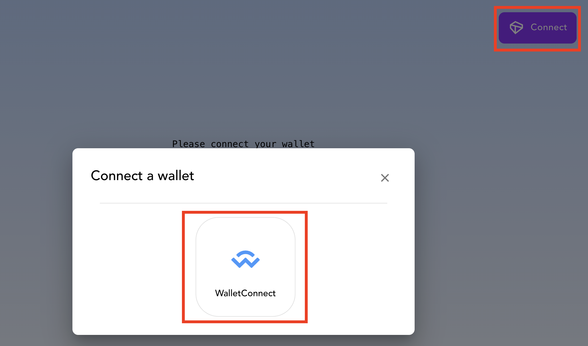
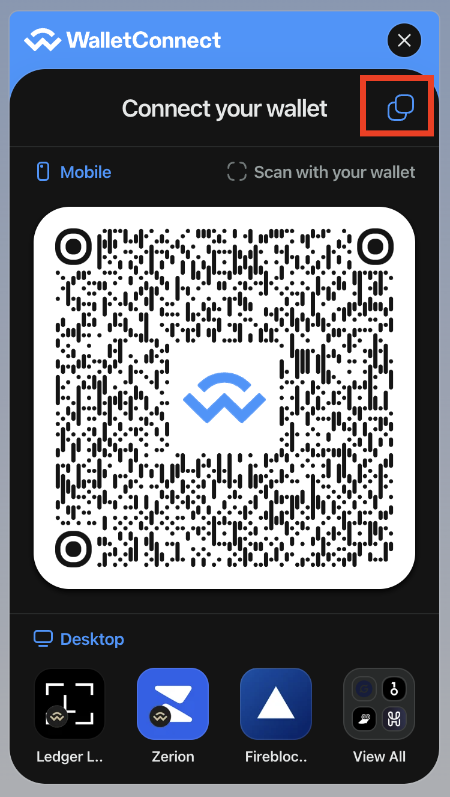
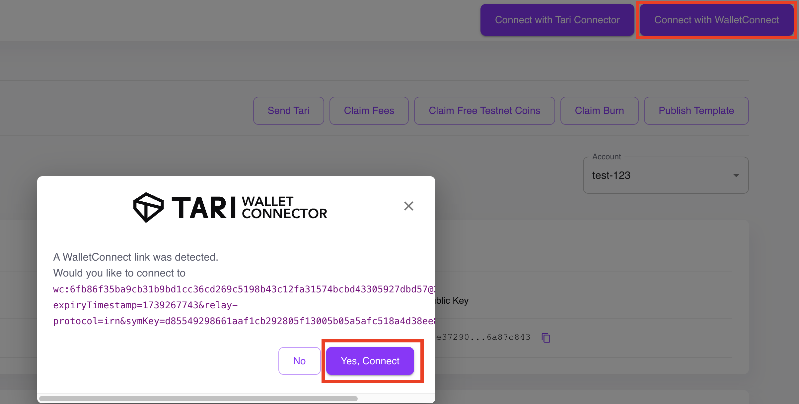
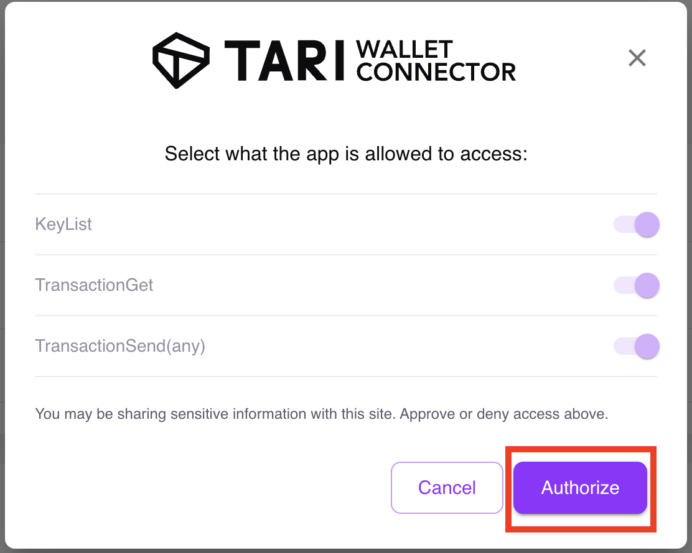
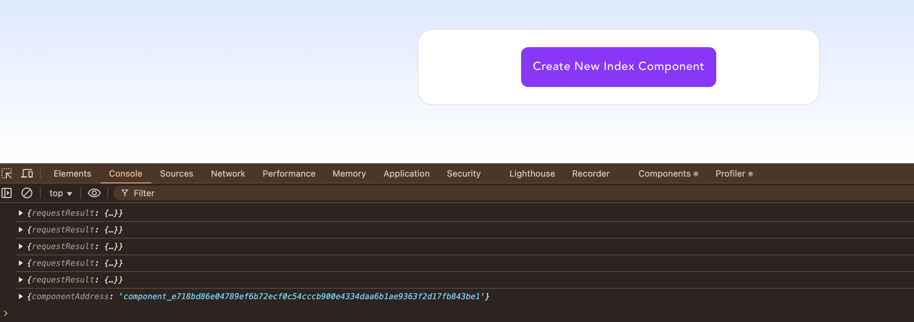
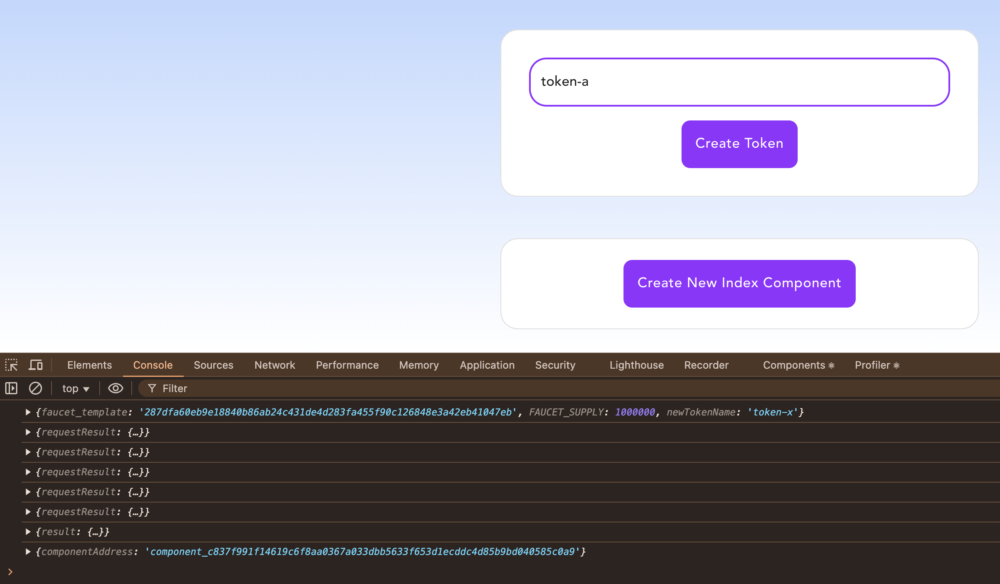
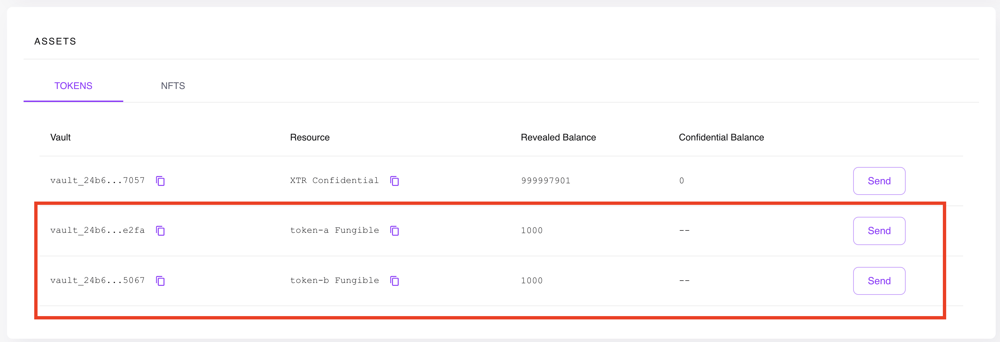
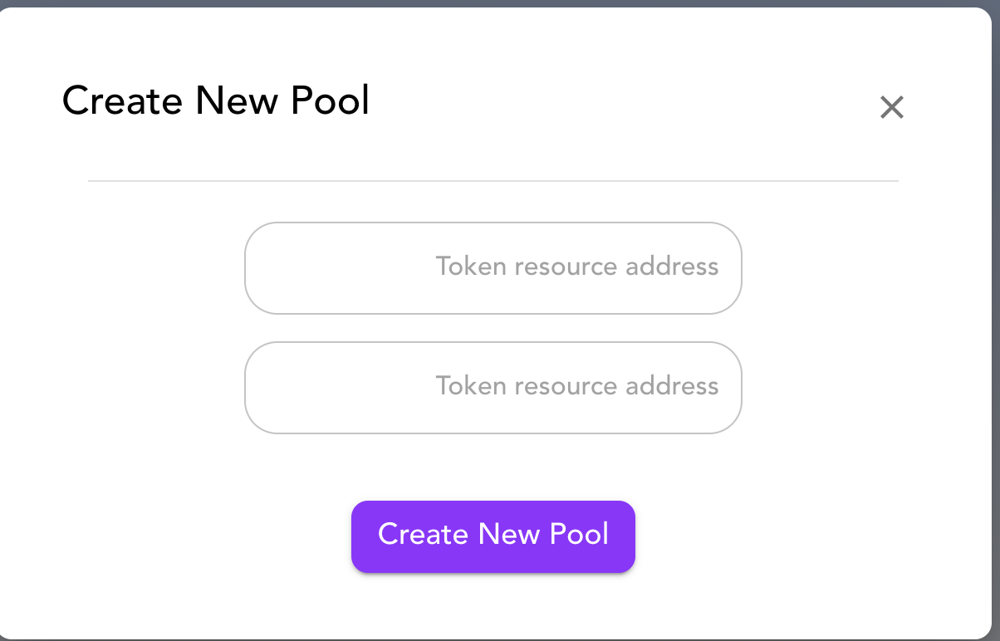
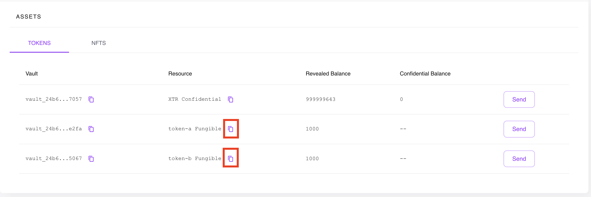

# tariswap-ui

This project implements a web interface using [Vite](https://vitejs.de) for the [`tariswap`](https://github.com/tari-project/test-templates) Tari template.

The `tariswap` template implements a decentralized exchange smart contract on the Tari network, using a constant-product automated market maker. It allows swapping tokens, adding liquidity and removing liquidity.

# Getting Started

## Install templates

We need a running Tari network with the following:
* Both `tariswap_index` and `tariswap_pool` templates deployed. The code can be found in the Tari [test-templates](https://github.com/tari-project/test-templates/tree/main/templates/tariswap/templates) repository.
* The `faucet` template deployed. It can be found in the Tari [template_test_tooling](https://github.com/tari-project/tari-dan/tree/development/dan_layer/template_test_tooling/templates/faucet) crate.

If you plan to use `ContractNet`, most likely these templates are already deployed.
Otherwise, you will need to build WASM templates and upload them to Tari chain using one of many available methods. One of them is using Tari Wallet `Publish Template` feature.

## Provide configuration in .env file

Copy the `.env.example` file to `.env` and edit the correct environment variable values.

For the `VITE_POOL_INDEX_COMPONENT` variable we have a bit of a chicken-and-egg situation. One way to solve this is by running the web (leaving that envvar empty) and create a new index component using the `Utilitites -> Create New Index Component` section in the web. Then set the environment value and restart the web.

## Run the application

To run the web:
```shell
npm install
npm run dev
```

### Connect to your wallet

Click on `Connect` button on the top right corner, choose `WalletConnect` option.



Copy the connection id by clicking on copy icon on the top right corner.



Go to your wallet and click `Connect with WalletConnect` button.
A dialog will appear asking you to approve the connection.



Authorize it on the next screen.



Now you should be connected. Go back to application and the connection button now should read `Connected`.

### Create a new index component

As it was already described above, the you need to create an instance of index component and register it in `.env` file.

Open console in your browser, so you can see debug messages. The results of interactions with chain will be displayed there.

Go to `Utilities` -> `Create New Index Components`. Upon successful execution, you should see `componentAddress` in console. Copy the value without quotes and update `VITE_POOL_INDEX_COMPONENT` variable in `.env` file.



### Create faucet components for tokenA and tokenB

Next, create two faucet components, which you will be able to use to mint new tokens of those types.

Go to `Utilities` -> `Create Token`, enter token name (such as "token-a") and create token faucet. Keep the console open to store faucet component address. It will be necessary later to withdraw tokens from faucet into your wallet.

Repeat the same action for second token faucet.



### Withdraw tokens from faucet into your account

Go to `Utilities` -> `Take Tokens`, enter faucet component address from step above and execute the transaction. Do the same for both token types.

If the operation was successful, you should see these tokens appear in your wallet under `Assets` -> `Tokens`.



### Create a new pool

Now you are ready to create a new pool.

Go to `Pools` -> `Create New Pool`.



A dialog will appear requesting to enter resource addresses of tokens. Those can be obtained by copying them in wallet as seen in the picture.



### Add and remove liquidity

After the pool is created you can add or remove liquidity, as well as perform swap operations.


